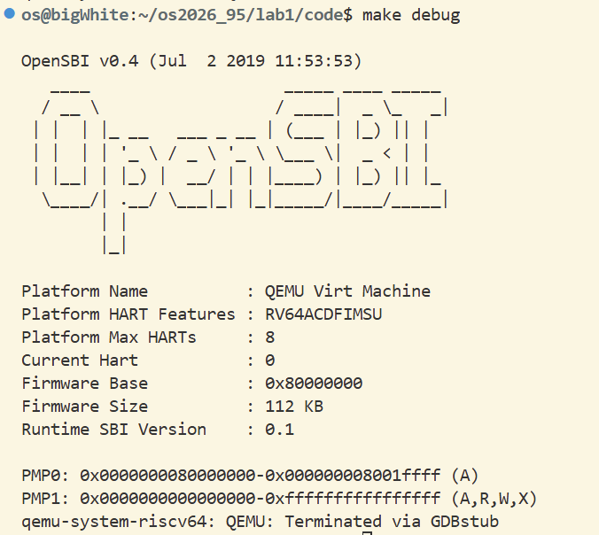
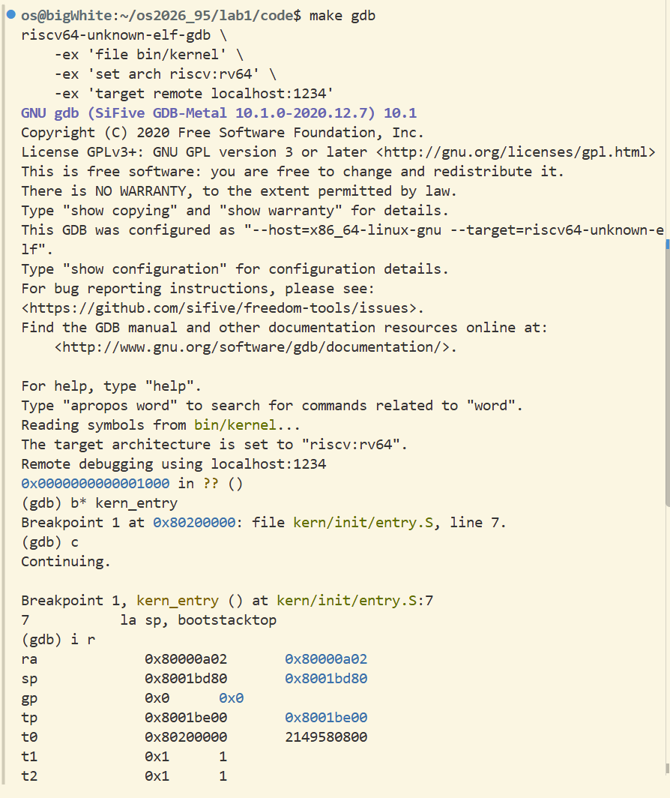
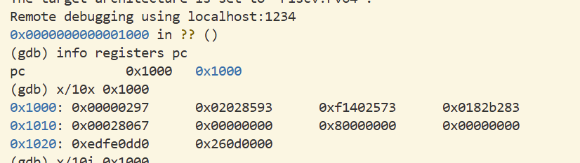

# 操作系统实验报告

## 实验基本信息

| 项目 | 内容 |
|------|------|
| **实验名称** | Lab1 : 最小可执行内核 |
| **小组成员** | 2413330-张子馨、2410691-刘思岑、2411191-王可 |
| **完成日期** | 2026-10-2 |

### 小组分工

| 成员 | 负责的练习 |
|------|----------------|
| 2413330-张子馨 | 练习2 |
| 2410691-刘思岑 | 练习2 |
| 2411191-王可 | 练习1 |

### 实验报告分工

2413330-张子馨负责实验报告整体框架修改以及撰写实验目的和实验内容中负责练习部分，2410691-刘思岑负责撰写实验逻辑梳理以及实验内容中负责练习部分，2411191-王可负责整理对每个功能的核心函数或功能模块的理解以及实验内容中负责练习部分，全组共同完成撰写实验总结与收获部分。

---

## 一、实验目的

本实验的主要目的是：

1. 学习最小可执行内核和启动流程
2. 学习使用链接脚本描述内存布局
3. 使用qemu、gdb理解编译调试流程

---

## 二、实验环境

使用的 AI 工具

| 成员 | AI 编程工具 | 底层模型 | 备注 |
|------|------------|---------|------|
| 2413330-张子馨| Cline（VS Code插件）|  DeepSeek-V4-Flash和DeepSeek-V4-pro| 勾选了计划和执行时使用不同的模型 |
| 2410691-刘思岑|Codex(VS Code插件)|ChatGPT-5.6 Sol| 无
| 2411191-王可| Codex（终端Agent）|GPT-6.1-Sol| 使用WSL环境运行Codex终端Agent|

---

## 三、实验整体逻辑分析

### 本章节的逻辑主线
本章实验围绕 “最小可执行内核如何从一组源代码变成能够在 RISC-V 计算机上启动的程序” 这一核心问题展开，因为用 Qemu 模拟 RISC-V 计算机，所以也就是需要建立从最小可执行内核正确对接到 Qemu 模拟器上所需的最基本链路，完成最小内核的启动与调试。

链路过程可以概括为：生成内核镜像、把内核放到约定的内存地址、建立 C 语言运行环境，并通过控制台输出信息来证明内核已经成功运行。

实验的整体流程如下：

    首先，使用 RISC-V 交叉编译工具链，将 C 代码和汇编代码编译为 RISC-V 目标文件。随后，链接器根据 tools/kernel.ld 链接脚本，将各目标文件组合成 ELF 格式的内核文件。链接脚本规定内核从物理地址 0x80200000 开始布局，并指定 kern_entry 为程序入口。之后再使用 objcopy 将 ELF 文件转换为便于 QEMU 加载的二进制内核镜像。

  QEMU 启动后，模拟 RISC-V 计算机的加电过程。CPU 首先从复位地址 0x1000 执行少量初始化代码，随后进入位于 0x80000000 的 OpenSBI。OpenSBI 在机器态完成底层硬件环境初始化，并最终将控制权交给位于 0x80200000 的内核入口 kern_entry。

    进入内核后，kern/init/entry.S 中的入口代码首先把 sp 设置为 bootstacktop，为内核建立可用的栈空间，然后跳转到 C 语言函数 kern_init()。kern_init() 会清零 .bss 段，保证未显式初始化的全局变量和静态变量初值为零；之后调用 cprintf() 输出内核启动信息，最后进入无限循环，使内核不会返回到不存在的上层调用者。

由于此时还没有完整的操作系统和 C 标准库，内核不能直接使用普通的 printf()。因此，实验从 OpenSBI 提供的单字符输出服务出发，通过 ecall 从内核所在的 S 模式进入 OpenSBI 所在的 M 模式，再逐层封装为 sbi_console_putchar()、cons_putc() 和 cprintf()，最终实现格式化输出功能。

当终端显示：(THU.CST) os is loading ...就说明内核已经成功完成编译、加载、入口跳转、栈初始化和控制台输出。
  
    最后，本章使用 QEMU 与 GDB 的远程调试功能，对上述启动流程进行验证。通过观察程序计数器 pc 从复位地址 0x1000，经过 OpenSBI 所在区域，最终到达内核入口 0x80200000，可以直观确认从硬件复位、固件初始化到操作系统内核开始运行的完整控制权交接过程。
  
  综上，本实验解决的问题是：如何让一份脱离现有操作系统运行环境的 RISC-V 内核代码，被正确编译和布局，在 QEMU 模拟的计算机中经过 OpenSBI 启动，建立最基本的 C 语言运行条件，并成功输出第一条内核信息。

### 功能的核心函数理解
1. kern_entry：位于kern/init/entry.S中，是内核真正开始执行的入口，地址为0x80200000。由于此时还没有建立C语言运行环境，因此kern_entry首先需要完成底层初始化工作。它首先通过la sp, bootstacktop将栈指针设置到内核栈顶，为运行C语言函数准备栈空间；随后通过tail kern_init跳转到kern_init()。

2. kern_init()：位于kern/init/init.c中，是内核的C语言入口函数。它首先使用memset()清零.bss段，保证未初始化的全局变量和静态变量初值为零；随后调用cprintf()输出内核启动信息；最后进入无限循环，避免内核返回到不存在的调用者。

3. memset()：把指定内存区域设置为相同的值。本实验使用它将edata到end之间的.bss段全部清零，为后续C语言代码提供正确的运行环境。

4. cprintf()：内核提供的格式化输出函数，作用类似普通程序中的printf()。它负责处理字符串和格式化参数，然后把需要输出的内容逐个字符交给底层控制台输出函数。由于此时内核没有完整的C标准库，因此不能直接使用普通的printf()。

5. cons_putc()：控制台的单字符输出接口，负责接收上层格式化输出产生的字符，并将其传递到底层输出函数。它位于格式化输出和SBI底层服务之间，把cprintf()产生的字符继续传递给sbi_console_putchar()。

6. sbi_console_putchar()与sbi_call()：sbi_console_putchar()和sbi_call()负责完成内核与OpenSBI之间的交互。由于uCore内核运行在RISC-V的S模式，而底层硬件控制功能由运行在M模式下的OpenSBI提供，因此内核不能直接访问底层设备，而需要通过SBI接口向OpenSBI请求服务。sbi_console_putchar()用于调用OpenSBI提供的字符输出服务，而sbi_call()负责设置SBI调用所需的寄存器，并通过RISC-V的ecall指令触发环境调用，使CPU从S模式进入M模式，由OpenSBI完成真正的字符输出。整个调用流程为：cprintf()进行格式化处理，调用cons_putc()输出字符，随后进入sbi_console_putchar()，通过sbi_call()执行ecall，最终由OpenSBI完成控制台输出。

## 四、实验内容与实现

### 练习1：[理解内核启动中的程序入口操作]

**负责人：** [2411191-王可]

1.阅读 kern/init/entry.S内容代码，结合操作系统内核启动流程，说明指令 la sp, bootstacktop 完成了什么操作，目的是什么？

答：`la sp, bootstacktop`通过地址加载伪指令`la`，将启动栈顶端`bootstacktop`的地址写入栈指针寄存器`sp`。该操作建立有效的初始栈环境，为`kern_init`及后续函数调用提供栈空间，完成进入C语言初始化阶段的必要准备。

2.tail kern_init 完成了什么操作，目的是什么？

答：`tail kern_init`通过尾调用伪指令`tail`，将执行流程转移到`kern_init`，且不将返回地址写入`ra`。该操作在栈指针设置完成后，将控制权交给`kern_init`，由其执行后续C语言初始化工作。

### 练习2：[使用GDB验证启动流程]

**负责人：** [2413330-张子馨]、[2410691-刘思岑]

RISC-V 加电后，程序计数器首先被设置为 0x1000。该地址存放的是 QEMU 提供的复位 ROM 代码，这段代码负责准备启动参数，包括 hart ID、设备树地址和下一阶段固件入口，随后跳转到位于 0x80000000 的 OpenSBI。

这个阶段主要完成的任务有：取得当前地址、把设备树地址放入 a1、把 hart id 放入 a0、从数据区读出 OpenSBI 主入口 0x80000000 并跳转过去，从而进入固件的主初始化流程。

具体调试流程：
1. 开启两个终端分别运行make debug和make gdb，让gdb连接qemu

2. 在gdb调试查看pc寄存器值，执行指令 i r pc，得到结果0x1000，说明RISC-V 加电后最初执行的几条指令位于 0x1000

3. 通过x/5i 0x1000命令反汇编 0x1000 处的10条内存执行内容，其中前5条为指令，反汇编后依次为 
    auipc t0,0x0
    addi a1,t0,0x20
    csrr a0,mhartid
    ld t0,0x18(t0)
    jr t0
    
    它们完成的主要工作是为跳转到 OpenSBI 主初始化代码准备参数，然后跳转到 0x80000000 处的 OpenSBI 主初始化代码，同时将CPU控制权交给OpenSBI。

## 五、测试与验证

**测试截图：**

make debug截图：

make gdb截图：

练习二调试截图：

---

## 六、实验总结与收获

1. 计算机加电之后需要OpenSBI 固件将内核加载到内存中，内核加载到指定地址之后才能跳转执行。os原理中有提到计算机启动需要引导程序将内核从磁盘搬运到内存里后CPU才能取指运行。
二者都讲述了计算机启动的流程，区别是os原理里将内核搬到内存的引导程序不一致。

2. 操作系统内核与处理器控制权:
    在课程中，OS系统被描述为计算机资源的管理者和控制程序，负责控制处理器、内存和输入输出设备等资源；而本章实验展示的是操作系统获得控制权的最初阶段：CPU 从复位地址开始执行，经过 OpenSBI 的初始化，最终跳转到地址 0x80200000，开始执行 uCore 内核。
    二者的联系在于，只有内核取得处理器的控制权，后续的资源管理、进程调度和设备控制才有可能实现。课程中我们接触的是已经具备完整功能的OS，而lab1的内核目前只完成初始化和输出信息，并没有真正实现对各类资源的管理。

3. 指令执行、程序计数器与控制流：
    课程教材中指出，处理器按照PC中的地址取出并执行指令，pc决定了处理器下一步执行的位置。而 lab1 把教材中抽象的“指令周期”和“控制权转移”具体化————通过 GDB 观察程序计数器的变化，跟踪 CPU 从复位地址 0x1000，经过 OpenSBI 所在区域，最终到达内核入口 0x80200000 的过程，通过具体地址和调试过程展示了处理器如何从固件代码转入操作系统内核代码。

4. 特权级与受控的权限转换：
    教材介绍了用户态和内核态，指出普通程序不能直接执行特权指令，只有操作系统内核才能访问受保护的资源。RISC-V 对这一思想进行了更细的划分：OpenSBI 运行在机器态 M-mode，uCore 内核运行在监管态 S-mode，将来的用户程序则运行在用户态 U-mode；而lab1中内核通过执行 ecall，从 S-mode 进入 M-mode，请求 OpenSBI 提供字符输出服务。这与教材中的系统调用具有相似的控制权转移思想：低特权级程序不能直接完成某些操作，需要通过规定的入口请求高特权级程序提供服务。
二者的区别在于，通常的系统调用是用户程序从用户态进入操作系统内核态，即从 U-mode 进入 S-mode；而本实验中的 SBI 调用是内核向固件请求服务，即从 S-mode 进入 M-mode。

5. 无进程内核的执行方式：
    教材在操作系统的执行模型中介绍了“无进程的内核”：内核作为一个独立的特权程序运行，不属于某个普通用户进程。Lab1 中还没有创建任何进程或线程，CPU 进入 kern_entry 后，只沿着唯一的执行流进入 kern_init()，打印信息后进入无限循环。
    因此，Lab1 可以看作无进程内核的一个最小实例。它与完整操作系统的区别是，现代操作系统通常还要在多个进程之间进行切换，并在系统调用、中断和调度过程中反复进入和退出内核，而本实验始终只有一条执行流。

### AI 协作开发的经验
本次实验没有涉及到开发部分，主要是使用gdb调试和学习内核启动、生成可执行文件以及使用qemu模拟等相关知识，与AI对话的主要内容是为了更好的理解实验文档涉及的知识和翻译调试输出指令。

---

